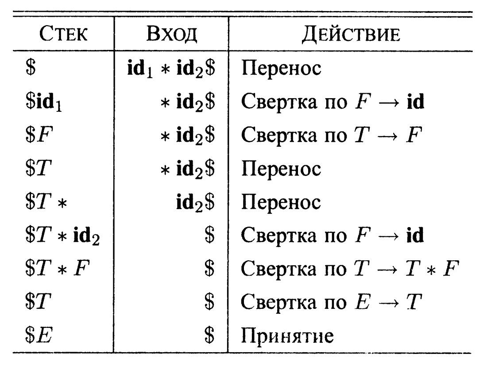

# Восходящий синтаксический анализатор типа "Перенос/свёртка"

Note: see READMEen.md for english version of this document.

Синтаксчиский анализ "перенос/свёртка") представляет собой разновидность восходящего
анализа, в котором для хранения символов грамматики используется стек, а для хранения остающейся непроанализированной части входной строки - входной буффер. 
Анализируемый рифметический язык состоит из сложения, вычитания, умножения, деления и
скобок. Операции могут производиться над переменными или же над числами. Далее будет описана грамматика, задающая данный язык.

Для получения токенов используется [**lexer**](https://github.com/RustamSubkhankulov/lexer), установленный в данном репозитории в формате статической библеотеки. Это лексический анализатор, разработанный мной в формате отдельного проекта. 

## Грамматика арифметических выражений

- E -> E + T | E - T | T
- T -> T * F | T / F | F
- F -> (E) | **id** | **num**


Грамматика выражений принадлежит классу **LR**-грамматик, которые подходят для восходящего синтаксического анализа. Эта грамматика может быть адаптирована для работы с дополнительными операторами и дополнительными уровнями приоритетов. Однако она не может быть использована для нисходящего синтаксического анализа в силу ее леворекурсивности.

## Восходящий синтаксический анализ

Восходящий синтаксический анализ соответствует построению дерева разбора для входной строки, начиная с листьев (снизу) и идя по направлению к корню (вверх). Удобно описывать синтаксический анализ как процесс построения дерева разбора, хотя начальная стадия компиляции может в действительности быть выполнена и без явного построения дерева. Последовательность "снимков" деревьев разбора на рисунке иллюстрирует восходящий синтаксический анализ для потока токенов id * id в соответствии с грамматикой выражений.


### Свёртки

Можно рассматривать восходящий синтаксический анализ как процесс "свертки" строки и к стартовому символу грамматики. На каждом шаге свертки (геduction) определенная подстрока, соответствующая телу продукции, заменяется нетерминалом из заголовка этой продукции.
Ключевые решения, принимаемые в процессе восходящего синтаксического анализа, — когда выполнять свертку и какую продукцию применять.

Последовательность свёрток для грамматики выражений:

**id** * **id**, F * **id**, I * **id**, T * F, T, E

По определению свертка представляет собой шаг, обратный порождению (вспомните, что в порождении нетерминал в сентенциальной форме замещается телом одной из его продукций). Цель восходящего синтаксического анализа, таким образом, состоит в построении порождения в обратном порядке. Вот порождение, соответствующее синтаксическому анализу, показанному на рисунке выше:
$$E→T → T*F→T * id → F * id → id * id$$
Данное порождение является правым.

### Синтаксический анализ "перенос/свертка"

Синтаксический анализ "перенос/свертка" (именуемый далее сокращенно ПС-анализом) представляет собой разновидность восходящего анализа, в которой для хранения символов грамматики используется стек, а для хранения остающейся непроанализированной части входной строки - входной буфер.

Изначально стек пуст, а входной буфер содержит всю последовательность токенов. В процессе сканирования входной строки слева направо синтаксический анализатор выполняет нуль или несколько переносов символов в стек, пока не будет готов выполнить свертку строки В символов грамматики на вершине стека. Затем он выполняет свертку В к заголовку соответствующей продукции. Синтаксический анализатор повторяет этот цикл до тех пор, пока не будет обнаружена ошибка или пока стек не будет содержать только стартовый символ, а входной буфер будет при этом пуст. Достигнув указанной конфигурации, синтаксический анализатор останавливается и сообщает об успешном завершении

Конфигурации ПС-анализатора при входной строке **id1** * **id2**:




### LR(0)-автоматы
Детерменированный конечный автомат, который используется для принятия решения в процессе синтаксического анализа для LR(0)-грамматики называется LR(0)-автоматом. В частности, каждое состояние LR(0)-автомата представляет множество пунктов в каноническом наборе LR(0). Состояниями этого автомата являются множества пунктов из канонического набора LR(0), а переходы определяются функцией GOTO.

Подробнее прочитать о структуре LR(0)-автоматов можно в [1].


Для нашей арифметической грамматики данный автомат будет отличаться незначительным образом.

### Расширенная грамматика арифметических выражений
Для построения канонического LR (0)-набора мы определяем расширенную грамматику и две функции, CLOSURE и GOTO. Если G - грамматика со стартовым символом S, то расширенная грамматика G' представляет собой G с новым стартовым символом S' и продукцией S' -> S. Назначение этой новой стартовой продукции - указать синтаксическому анализатору, когда следует прекратить анализ и сообщить о принятии входной строки; т.е. принятие осуществляется тогда и только тогда, когда синтаксический анализатор выполняет свертку с использованием продукции S' -> S.

Стартовое состояние LR (0)-автомата - **CLOSURE**({[S' → •S|}), где S - стартовый символ расширенной грамматики. Все состояния являются принимающими. Под состоянием $j$ далее подразумевается состояние, соответствующее множеству пунктов $I_{j}$. 

Каким образом LR(0)-автомат помогает в принятии решения "перенос/свертка"? Это решение может быть принято следующим образом. Предположим, что строка у из символов грамматики переводит LR(0)-автомат из состояния 0 в некоторое состояние $j$. Тогда выполним перенос очередного входного символа а, если состояние $j$ имеет переход для данного символа а. В противном случае выбирается свертка; пункт в состоянии $j$ говорит нам, какую продукцию следует для этого использовать.

- E' -> E
- E  -> E - T | E + T | T
- T  -> T * F | T / F | F
- F  -> (E) | **id**

Ниже приведены этапы анализа с указанием номеров состояний в стеке.


### Алгоритм LR-анализатора

LR-анализатор состоит из входного буфера, выхода, стека, программы-драйвера и таблицы синтаксического анализа, состоящей из двух частей (ACTION и GOTO). Программа-драйвер одинакова для всех LR-анализаторов; от одного анализатора к другому меняются таблицы син-таксического анализа. Программа синтаксического анализа по одному считывает символы из входного буфера. Там, где ПС-анализатор должен перенести символ, LR-анализатор переносит состояние. Каждое состояние подытоживает информа-цию, содержащуюся в стеке ниже него.

#### Структура таблицы LR-анализа
Таблица синтаксического анализа состоит из двух частей: функции действий синтаксического анализа ACTION и функции переходов GOTO.

1. Функция ACTION принимает в качестве аргумента состояние і и терминал
а (или $, маркер конца входной строки). Значение ACTION(i, а] может быть одного из следующих видов:
  -  Перенос j, где j — состояние. Действие, предпринимаемое синтакси-ческим анализатором, эффективно переносит входной символ а в стек, но для представления а использует состояние j.
  - Свертка А → В. Действие синтаксического анализатора состоит в эффективной свертке B на вершине стека в заголовок А.
  - Принятие. Синтаксический анализатор принимает входную строку и завершает анализ.
  - Ошибка. Синтаксический анализатор обнаруживает ошибку во вход-ной строке и предпринимает некоторое корректирующее действие.

2. Функция GOTO, определенная на множествах пунктов, распространяется на
состояния: если GOTO[$I_{i}$, A] = $I_{j}$, то GOTO отображаст также состояние і и нетерминал А на состояние j.

### Поведение анализатора 

Описать поведение LR-анализатора можно с помощью обозначений, представляющих полное состояние синтаксического анализатора: его стек и оставшуюся непроанализированной часть входной строки. Конфигурация LR-анализатора представляет собой пару (S0 S1 ... Sm, Ai Ai+1...An$)

Здесь первый компонент - содержимое стека (вершина стека справа), а второй компонент - оставшаяся непроанализированной часть входной строки.

Очередной шаг синтаксического анализатора из приведенной выше конфигурации определяется считанным текущим входным символом а и состоянием на вершине стека Sm путем обращения к записи ACTION(Sm, Ai].

Ниже приведена таблица синтаксического анализа для грамматики выражений (без деления и вычитания, в нашем случае она отличается незначительно).


(1) E -> E+T
(3) T -> T * F
(2) E -> T
(4) T -> F
(5) E -> (E)
(6) F -> id

1. si означает перенос и размещение в стеке состояния і.
2. r означает свертку в соответствии с продукцией с номером j.
3. асс означает принятие.
4. Пустое поле означает ошибку.

### Алгоритм LR-анализа


## Сборка
Для сборки проекта необходима система сборки CMake версии 3.21 и выше, а также установленная утилита генерации лексический анализаторов *flex*.
Чтобы собрать проект, воспользуйтесь следующими командами:
- <code>cmake -B build -DVERBOSE=ON</code>
- <code>cmake --build build --target lexer</code>

Опция **VERBOSE** включает вывод результатов работы парсера.

Пример вывода для выражения $(v1 - v2) / v3$
```
 -------------------------------------------------------------------------------------------------------
|ITER|STACK                           |INPUT                           |ACTION                          |
 -------------------------------------------------------------------------------------------------------
|0   |0                               |OP_BR v1 ADD v2 CL_BR DIV v3 $  |SHIFT 4                         |
 -------------------------------------------------------------------------------------------------------
|1   |0 4                             |v1 ADD v2 CL_BR DIV v3 $        |SHIFT 5                         |
 -------------------------------------------------------------------------------------------------------
|2   |0 4 5                           |ADD v2 CL_BR DIV v3 $           |REDUCE 8 F->id                  |
 -------------------------------------------------------------------------------------------------------
|3   |0 4 3                           |ADD v2 CL_BR DIV v3 $           |REDUCE 6 T->F                   |
 -------------------------------------------------------------------------------------------------------
|4   |0 4 2                           |ADD v2 CL_BR DIV v3 $           |REDUCE 3 E->T                   |
 -------------------------------------------------------------------------------------------------------
|5   |0 4 8                           |ADD v2 CL_BR DIV v3 $           |SHIFT 13                        |
 -------------------------------------------------------------------------------------------------------
|6   |0 4 8 13                        |v2 CL_BR DIV v3 $               |SHIFT 5                         |
 -------------------------------------------------------------------------------------------------------
|7   |0 4 8 13 5                      |CL_BR DIV v3 $                  |REDUCE 8 F->id                  |
 -------------------------------------------------------------------------------------------------------
|8   |0 4 8 13 3                      |CL_BR DIV v3 $                  |REDUCE 6 T->F                   |
 -------------------------------------------------------------------------------------------------------
|9   |0 4 8 13 14                     |CL_BR DIV v3 $                  |REDUCE 2 E->E-T                 |
 -------------------------------------------------------------------------------------------------------
|10  |0 4 8                           |CL_BR DIV v3 $                  |SHIFT 11                        |
 -------------------------------------------------------------------------------------------------------
|11  |0 4 8 11                        |DIV v3 $                        |REDUCE 7 F->(E)                 |
 -------------------------------------------------------------------------------------------------------
|12  |0 3                             |DIV v3 $                        |REDUCE 6 T->F                   |
 -------------------------------------------------------------------------------------------------------
|13  |0 2                             |DIV v3 $                        |SHIFT 15                        |
 -------------------------------------------------------------------------------------------------------
|14  |0 2 15                          |v3 $                            |SHIFT 5                         |
 -------------------------------------------------------------------------------------------------------
|15  |0 2 15 5                        |$                               |REDUCE 8 F->id                  |
 -------------------------------------------------------------------------------------------------------
|16  |0 2 15 16                       |$                               |REDUCE 5 T->T/F                 |
 -------------------------------------------------------------------------------------------------------
|17  |0 2                             |$                               |REDUCE 3 E->T                   |
 -------------------------------------------------------------------------------------------------------
|18  |0 1                             |$                               |ACCEPT                          |%
```

## Использование
Для проверки работы парсера подготовлена директория *examples*, содержащая пример программы подмножестве языка **Yazik++** (см. описание [тут](https://github.com/RustamSubkhankulov/lexer)), предназначенная для демонстрации работы лексера. Использованное подмножество задается 'арифметической грамматикой'.
Чтобы воспользоваться парсером, запустите исполняемый файл из директории *build* и подайте на вход текст программы или заранее заготовленную программу из *examples*.

##### Список литературы
- [1] Ахо, Альфред В., Лам, Моника С., Сети, Рави, Ульман, Джеффри Д. Компиляторы: принципы, технологии и инструментарий
