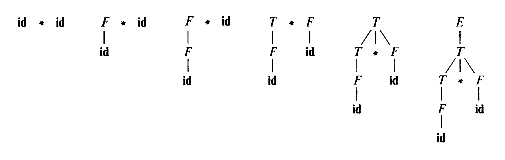
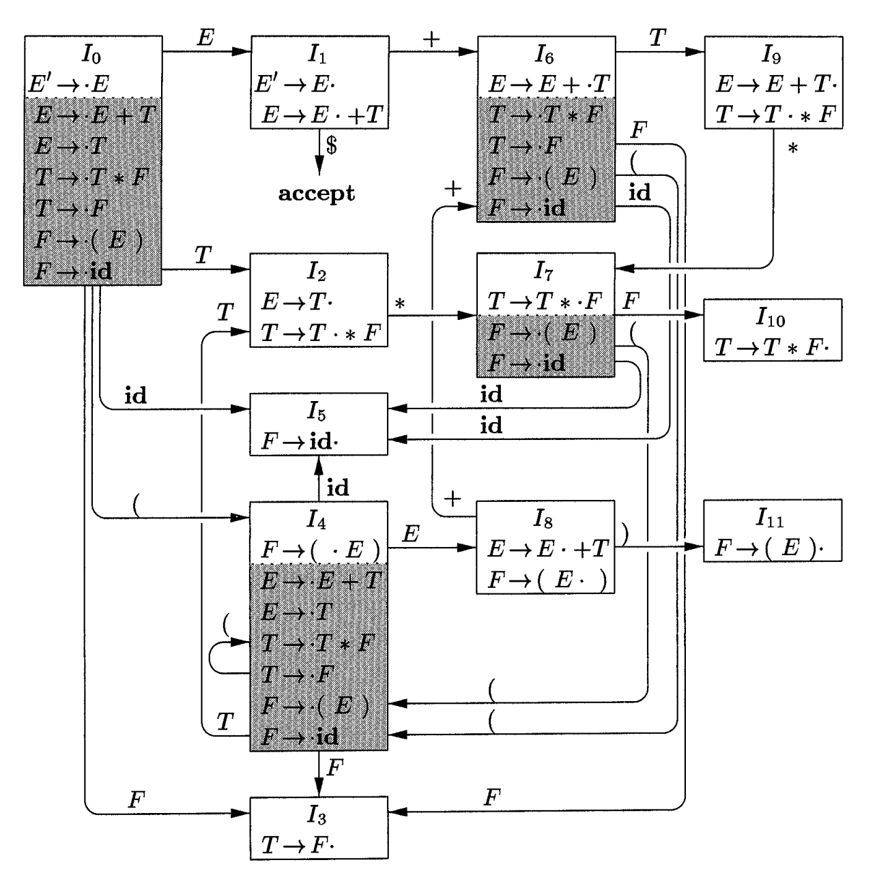
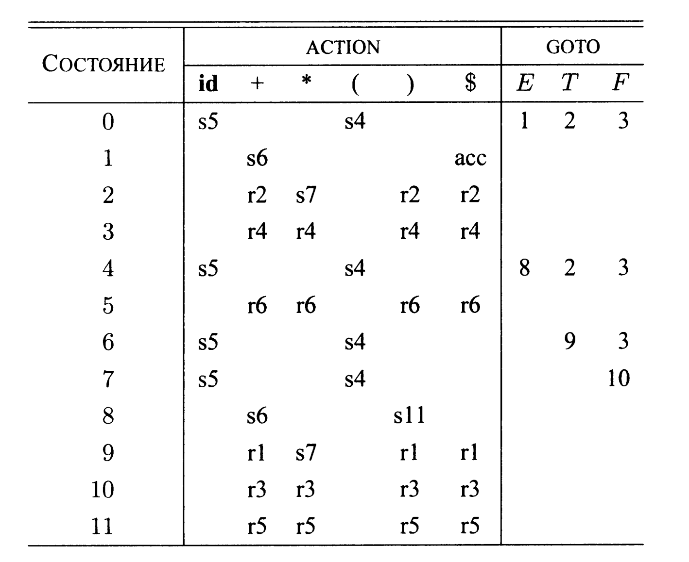
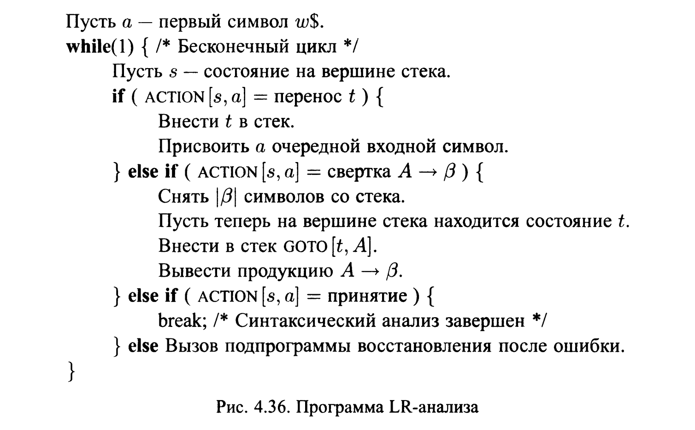

# Bottom-up wrap/reduce parser

Note: see READMEen.md for english version of this document.

Shift/reduce parsing is a type of bottom-up
analysis, which uses a stack to store grammar symbols and an input buffer to store the remaining unparsed portion of the input string.
The analyzed arhythmetic language consists of addition, subtraction, multiplication, division and
brackets. Operations can be performed on variables or on numbers. Next, the grammar that defines this language will be described.

To obtain tokens, [**lexer**](https://github.com/RustamSubkhankulov/lexer) is used, installed in this repository in the format of a static library. This is a lexical analyzer developed by me as a separate project.

## Grammar of arithmetic expressions

- E -> E + T | E - T | T
- T -> T * F | T/F | F
- F -> (E) | **id** | **num**


Expression grammar belongs to the class of **LR** grammars, which are suitable for bottom-up parsing. This grammar can be adapted to work with additional operators and additional priority levels. However, it cannot be used for top-down parsing due to its left recursiveness.

## Bottom-up parsing

Bottom-up parsing corresponds to constructing a parse tree for the input string, starting at the leaves (at the bottom) and working towards the root (at the top). It is convenient to describe parsing as the process of constructing a parse tree, although the initial stage of compilation may in fact be accomplished without explicitly constructing the parse tree. The sequence of parse tree snapshots in the figure illustrates bottom-up parsing for a stream of id * id tokens according to an expression grammar.



### Bundles

You can think of bottom-up parsing as the process of "folding" the string back to the starting character of the grammar. At each reduction step, a specific substring corresponding to the body of the production is replaced by a nonterminal from the header of this production.
The key decisions made during bottom-up parsing are when to reduce and what output to use.

Sequence of convolutions for expression grammar:

**id** * **id**, F * **id**, I * **id**, T * F, T, E

By definition, convolution is the inverse step of generation (remember that in generation a nonterminal in sentential form is replaced by the body of one of its productions). The goal of bottom-up parsing is thus to construct the derivation in reverse order. Here is the output corresponding to the parse shown in the figure above:
$$E→T → T*F→T * id → F * id → id * id$$
This generation is right.

### Shift/reduce parsing

Shift/Reduce parsing (hereafter abbreviated as SR parsing) is a type of bottom-up parsing that uses a stack to store grammar symbols and an input buffer to store the remaining unparsed portion of the input string.

Initially, the stack is empty, and the input buffer contains the entire sequence of tokens. As it scans the input string from left to right, the parser performs zero or more character pushes onto the stack until it is ready to collapse the string B of grammar characters at the top of the stack. It then rolls up B to the corresponding production header. The parser repeats this loop until an error is detected or until the stack contains only the start character and the input buffer is empty. When the parser reaches the specified configuration, it stops and reports success.

Configurations of the SR analyzer with the input line **id1** * **id2**:


### LR(0)-automata
A deterministic finite state machine that is used to make decisions during the parsing process for an LR(0) grammar is called an LR(0) automaton. In particular, each state of an LR(0) automaton represents a set of items in the canonical set LR(0). The states of this automaton are sets of items from the canonical set LR(0), and transitions are determined by the GOTO function.

You can read more about the structure of LR(0) automata in [1].



For our arithmetic grammar, this machine will differ insignificantly.

### Extended grammar of arithmetic expressions
To construct a canonical LR(0) set, we define an extended grammar and two functions, CLOSURE and GOTO. If G is a grammar with a starting symbol S, then an extended grammar G' is G with a new starting symbol S' and a production S' -> S. The purpose of this new starting production is to indicate to the parser whatru when to stop parsing and report acceptance of the input string; those. acceptance occurs if and only if the parser performs a convolution using the production S' -> S.

The starting state of an LR (0) automaton is **CLOSURE**({[S' → •S|}), where S is the starting symbol of the extended grammar. All states are accepting. By state $j$ we further mean the state corresponding to the set of points $I_{j}$.

How does an LR(0) automaton help with the carry/reduce decision? This decision can be made as follows. Suppose that a string y of grammar symbols transfers an LR(0) automaton from state 0 to some state $j$. Then we carry out the transfer of the next input symbol a, if the state $j$ has a transition for the given symbol a. Otherwise, convolution is chosen; the item in state $j$ tells us which products should be used for this.

- E' -> E
- E -> E - T | E+T | T
- T -> T * F | T/F | F
- F -> (E) | **id**

Below are the stages of analysis, indicating the state numbers in the stack.


### SLR analyzer algorithm

An SLR parser ("Simple LR") consists of an input buffer, an output, a stack, a driver program, and a parse table consisting of two parts (ACTION and GOTO). The driver program is the same for all LR analyzers; The parsing tables change from one analyzer to another. The parser reads characters one at a time from the input buffer. Where the SR parser needs to transfer a symbol, the LR parser transfers the state. Each state summarizes the information contained in the stack below it.

#### CLOSURE и GOTO

Если I - множество пунктов грамматики G, то CLOSURE(I) представляет собой множество пунктов, построенное из I согласно двум правилам.
1. Изначально в CLOSURE (I) добавляются все пункты из I.
2. Если А → а - ВВ входит в CLOSURE (I), а В → у является продукцией, то в CLOSURE (I) добавляется пункт В → 7, если его там еще нет. Это правило применяется до тех пор, пока не останется пунктов, которые могут быть добавлены в CLOSURE (I).

Второй полезной функцией является GOTO(I, Х), где I - множество пунктов, а X - грамматический символ. GOTO(I, Х) определяется как замыкание множества всех пунктов (А → аХ • В], таких, что [А → а • ХВ) находится в I.

#### Structure of the SLR analysis table
The parse table consists of two parts: the ACTION parse action function and the GOTO transition function.

1. The ACTION function takes the state and the terminal as an argument
a (or $, end-of-input line marker). The value of ACTION(i, a] can be one of the following:
   - Shift j, where j is the state. The action taken by the parser effectively pushes the input symbol a onto the stack, but uses the state j to represent a.
   - Reduce A → B. The action of the parser is to effectively reduce B at the top of the stack into the head of A.
   - Acceptance. The parser accepts the input string and completes the parsing.
   - Error. The parser detects an error in the input string and takes some corrective action.

2. The GOTO function defined on sets of items extends to
states: if GOTO[$I_{i}$, A] = $I_{j}$, then GOTO also maps state i and nonterminal A to state j.

### Analyzer behavior

The behavior of an SLR parser can be described using notations that represent the complete state of the parser: its stack and the remaining unparsed portion of the input string. The SLR analyzer configuration is a pair (S0 S1 ... Sm, Ai Ai+1...An$)

Here the first component is the contents of the stack (top of the stack on the right), and the second component is the remaining unparsed part of the input string.

The next parser step from the above configuration is determined by reading the current input symbol a and the state at the top of the stack Sm by accessing the ACTION(Sm, Ai] entry.

Below is a parsing table for the grammar of expressions (without division and subtraction, in our case it differs slightly).



(1) E -> E+T
(3) T -> T * F
(2) E -> T
(4) T -> F
(5) E -> (E)
(6) F -> id

1. si means carrying and placing the state i on the stack.
2. r means convolution according to production number j.
3. ass means acceptance.
4. An empty field means an error.

### Method for constructing an SLR table

INPUT: extended grammar G'.
Output: SLR parse table functions ACTION and GOTO for grammar G' .
Method: perform the following steps.
1. We construct C = {I0, I1,... , In) - a set of sets of LR(0)-points for G'.
2. From II we construct state i. The parsing action for state i is defined as follows.
   - If [A → α•aß) belongs to Ii and GOTO (Ii, a) = Ij, then set ACTION(i, a]
equal to "carry j". Here a should be a terminal.
   - If [A → a•] belongs to Ii, then set ACTION[i, a) equal to “convolution A → a” for all a from FOLLOW(A); here A should not be equal to S'.
   - If [S' → S•] belongs to Ii, then set ACTION(i, $) equal to "acceptance".
If there is any conflict between actions resulting from the application of these rules, it is concluded that the grammar does not belong to the class SLR(1). In this case, the algorithm cannot build a parser for the given grammar.
3. We build transitions for state i for all non-terminals A using
using the following rule: if GOTO(Ii, A) = Ij, then GOTO(i, A) = j.
4. All records not defined by rules 2 and 3 receive the value "error".
5. We construct the initial state of the parser from a set of points containing (S' → •S].

### SLR analysis algorithm




## Building
To build the project, you need the CMake build system version 3.21 and higher, as well as the *flex* lexical analyzer generation utility installed.
To build the project, use the following commands:
- <code>cmake -B build -DVERBOSE=ON</code>
- <code>cmake --build build --target lexer</code>

The **VERBOSE** option turns on the output of the parser results.

Example output for the expression $(v1 - v2) / v3$
```
 -------------------------------------------------------------------------------------------------------
|ITER|STACK                           |INPUT                           |ACTION                          |
 -------------------------------------------------------------------------------------------------------
|0   |0                               |OP_BR v1 ADD v2 CL_BR DIV v3 $  |SHIFT 4                         |
 -------------------------------------------------------------------------------------------------------
|1   |0 4                             |v1 ADD v2 CL_BR DIV v3 $        |SHIFT 5                         |
 -------------------------------------------------------------------------------------------------------
|2   |0 4 5                           |ADD v2 CL_BR DIV v3 $           |REDUCE 8 F->id                  |
 -------------------------------------------------------------------------------------------------------
|3   |0 4 3                           |ADD v2 CL_BR DIV v3 $           |REDUCE 6 T->F                   |
 -------------------------------------------------------------------------------------------------------
|4   |0 4 2                           |ADD v2 CL_BR DIV v3 $           |REDUCE 3 E->T                   |
 -------------------------------------------------------------------------------------------------------
|5   |0 4 8                           |ADD v2 CL_BR DIV v3 $           |SHIFT 13                        |
 -------------------------------------------------------------------------------------------------------
|6   |0 4 8 13                        |v2 CL_BR DIV v3 $               |SHIFT 5                         |
 -------------------------------------------------------------------------------------------------------
|7   |0 4 8 13 5                      |CL_BR DIV v3 $                  |REDUCE 8 F->id                  |
 -------------------------------------------------------------------------------------------------------
|8   |0 4 8 13 3                      |CL_BR DIV v3 $                  |REDUCE 6 T->F                   |
 -------------------------------------------------------------------------------------------------------
|9   |0 4 8 13 14                     |CL_BR DIV v3 $                  |REDUCE 2 E->E-T                 |
 -------------------------------------------------------------------------------------------------------
|10  |0 4 8                           |CL_BR DIV v3 $                  |SHIFT 11                        |
 -------------------------------------------------------------------------------------------------------
|11  |0 4 8 11                        |DIV v3 $                        |REDUCE 7 F->(E)                 |
 -------------------------------------------------------------------------------------------------------
|12  |0 3                             |DIV v3 $                        |REDUCE 6 T->F                   |
 -------------------------------------------------------------------------------------------------------
|13  |0 2                             |DIV v3 $                        |SHIFT 15                        |
 -------------------------------------------------------------------------------------------------------
|14  |0 2 15                          |v3 $                            |SHIFT 5                         |
 -------------------------------------------------------------------------------------------------------
|15  |0 2 15 5                        |$                               |REDUCE 8 F->id                  |
 -------------------------------------------------------------------------------------------------------
|16  |0 2 15 16                       |$                               |REDUCE 5 T->T/F                 |
 -------------------------------------------------------------------------------------------------------
|17  |0 2                             |$                               |REDUCE 3 E->T                   |
 -------------------------------------------------------------------------------------------------------
|18  |0 1                             |$                               |ACCEPT                          |%
```

## Usage
To test the operation of the parser, a directory *examples* has been prepared, containing an example program for a subset of the **Yazik++** language (see description [here](https://github.com/RustamSubkhankulov/lexer)), intended to demonstrate the operation of the lexer. The subset used is specified by an 'arithmetic grammar'.
To use the parser, run the executable file from the *build* directory and provide the program text or a pre-prepared program from *examples* as input.

##### Bibliography
- [1] Aho, Alfred W., Lam, Monica S., Sethi, Ravi, Ullman, Jeffrey D. Compilers: Principles, Technologies and Tools